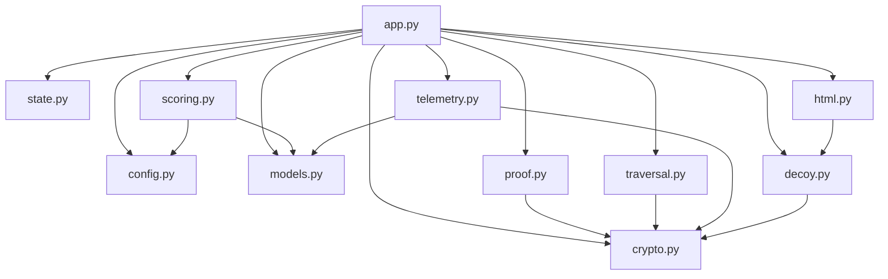

# SinkHole — Complete Implementation Blueprint

> **Version**: 1.0 · **Date**: 2026-03-13 · **Status**: Living Document
>
> This document specifies **every component, data flow, endpoint, scoring formula, token lifecycle, and line of defense** in the SinkHole Botwall system. It is the single source of truth for implementation. Nothing is left implicit.

---

# Table of Contents

1. [System Architecture Overview](#1-system-architecture-overview)
2. [Project Structure & File Manifest](#2-project-structure--file-manifest)
3. [Configuration System](#3-configuration-system)
4. [Cryptographic Primitives](#4-cryptographic-primitives)
5. [Stage 1 — Entry Gate (PoW + Environment)](#5-stage-1--entry-gate)
6. [Stage 2 — In-Website Detection & Scoring](#6-stage-2--in-website-detection--scoring)
7. [SDK — Client-Side Signal Collection](#7-sdk--client-side-signal-collection)
8. [Scoring Engine — Complete Formulas](#8-scoring-engine--complete-formulas)
9. [Token System — All Token Types](#9-token-system--all-token-types)
10. [Proof-of-Traversal Pipeline](#10-proof-of-traversal-pipeline)
11. [Decision Engine — Complete Logic](#11-decision-engine--complete-logic)
12. [Layer 2 — Decoy Hellhole](#12-layer-2--decoy-hellhole)
13. [Recovery System — False-Positive Exit](#13-recovery-system--false-positive-exit)
14. [Telemetry Mesh — Cross-Server Intelligence](#14-telemetry-mesh--cross-server-intelligence)
15. [State Management — Session Store](#15-state-management--session-store)
16. [API Reference — All Endpoints](#16-api-reference--all-endpoints)
17. [Web Server Integration](#17-web-server-integration)
18. [Testing Strategy](#18-testing-strategy)
19. [Deployment Checklist](#19-deployment-checklist)
20. [Threat Model & Known Limitations](#20-threat-model--known-limitations)

---

# 1. System Architecture Overview

## High-Level Flow

```
                    ┌─────────────────────────────────────────────────────┐
                    │                    INTERNET                         │
                    └────────────────────┬────────────────────────────────┘
                                         │
                                         ▼
                    ┌─────────────────────────────────────────────────────┐
                    │        REVERSE PROXY (Nginx / Caddy / Apache)       │
                    │  • TLS termination                                  │
                    │  • JA3 fingerprint extraction → X-JA3 header        │
                    │  • IP reputation lookup → X-IP-Reputation header    │
                    │  • auth_request / forward_auth to Botwall           │
                    └────────────────────┬────────────────────────────────┘
                                         │
                            ┌────────────┴────────────┐
                            ▼                         ▼
                    ┌──────────────┐          ┌──────────────┐
                    │  STAGE 1     │          │  STAGE 2     │
                    │  ENTRY GATE  │          │  IN-WEBSITE  │
                    │              │          │  DETECTION   │
                    │  PoW puzzle  │          │              │
                    │  Env checks  │          │  SDK beacon  │
                    │  Gate token  │          │  Scoring     │
                    │              │          │  Traversal   │
                    └──────┬───────┘          │  Decision    │
                           │                  └───┬──┬──┬────┘
                           │                      │  │  │
                           └──────►        ┌──────┘  │  └──────┐
                                           ▼         ▼         ▼
                                        ALLOW    CHALLENGE   DECOY
                                           │         │         │
                                           ▼         ▼         ▼
                                      Real page   Proof page  Hellhole
                                                               │
                                                          Recovery path
                                                               │
                                                               ▼
                                                            ALLOW
```

## Core Principle

**Defense in depth through economic asymmetry.**

- For a legitimate human: PoW takes ~1 second (once), then browsing is normal.
- For a bot operator scraping 10,000 pages: PoW = 10,000 × 1.5s = 4.2 hours of CPU. Then they must also fake behavioral sequences across multiple requests, match TLS fingerprints, avoid traps, and produce consistent navigation patterns. If caught (Layer 2), the scraped data is poisoned with plausible-looking relational contradictions.

The system doesn't need to be unbreakable. It needs to make **the cost of bypassing exceed the value of the scraped data**.

---

# 2. Project Structure & File Manifest

```
sinkhole/
├── botwall.toml                 # ← ALL configuration lives here
├── pyproject.toml               # Python packaging / pytest config
├── requirements.txt             # pip dependencies
├── README.md                    # Project overview
├── HARDENING_PLAN.md            # High-level strategy document
├── IMPLEMENTATION_DETAIL.md     # ← THIS FILE
├── .gitignore                   # venv, __pycache__, etc.
│
├── botwall/                     # ── Python package ──
│   ├── __init__.py              # Package marker
│   ├── __main__.py              # Entry point: `python -m botwall`
│   ├── config.py                # TOML loader + Settings dataclass
│   ├── crypto.py                # HMAC signing, hashing, b64 encode
│   ├── models.py                # Pydantic models (BeaconEvent, etc.)
│   ├── state.py                 # InMemoryStore / RedisStore
│   ├── scoring.py               # Score engine (request, beacon, sequence)
│   ├── proof.py                 # Per-page proof token issue/verify
│   ├── traversal.py             # Traversal token issue/verify
│   ├── telemetry.py             # Behavioral fingerprint mesh
│   ├── decoy.py                 # Synthetic content graph
│   ├── html.py                  # SDK JS, challenge page, decoy page HTML
│   └── app.py                   # FastAPI application + all routes
│
├── tests/                       # ── Test suite ──
│   ├── test_tokens.py           # Proof + traversal token unit tests
│   ├── test_scoring.py          # Scoring formula unit tests
│   ├── test_decoy.py            # Decoy graph tests
│   └── test_api_integration.py  # Full HTTP flow integration tests
│
├── deploy/                      # ── Web server configs ──
│   ├── nginx.conf               # Template: Nginx auth_request
│   ├── Caddyfile                # Template: Caddy forward_auth
│   ├── apache.conf              # Template: Apache mod_proxy
│   ├── apache-botwall.lua       # Template: Apache mod_lua
│   └── rendered/                # Auto-generated from botwall.toml
│       ├── nginx.conf
│       ├── Caddyfile
│       ├── apache.conf
│       └── apache-botwall.lua
│
└── scripts/
    ├── render_deploy.py          # Generate deploy configs from TOML
    └── playwright/               # Browser automation test scripts
        └── README.md
```

### Module Dependency Graph



---

# 3. Configuration System

## File: `botwall/config.py`

### Load Order (highest priority wins)

```
1. Environment variables        (BOTWALL_SECRET_KEY, BOTWALL_PORT, etc.)
2. BOTWALL_CONFIG env var path  (e.g. /etc/botwall/prod.toml)
3. ./botwall.toml               (current working directory)
4. ~/.config/botwall/botwall.toml
5. Built-in defaults            (hardcoded in Settings dataclass)
```

### Settings Dataclass — Complete Field Reference

| Section | Field | Type | Default | Env Var Override | What It Controls |
|:---|:---|:---|:---|:---|:---|
| **server** | `app_host` | str | `127.0.0.1` | `BOTWALL_HOST` | Bind address for Uvicorn |
| | `app_port` | int | `4000` | `BOTWALL_PORT` | Bind port |
| | `session_cookie` | str | `bw_sid` | `BOTWALL_SESSION_COOKIE` | Stage 2 session cookie name |
| | `gate_cookie` | str | `bw_gate` | `BOTWALL_GATE_COOKIE` | Stage 1 gate token cookie name |
| **secrets** | `secret_key` | str | `dev-change-me` | `BOTWALL_SECRET_KEY` | HMAC signing key for all tokens |
| | `telemetry_secret` | str | `telemetry-dev-secret` | `BOTWALL_TELEMETRY_SECRET` | Separate key for telemetry feed signing |
| **redis** | `redis_enabled` | bool | `false` | `BOTWALL_REDIS_ENABLED=1` | Use Redis vs in-memory store |
| | `redis_url` | str | `redis://127.0.0.1:6379/0` | `BOTWALL_REDIS_URL` | Redis connection string |
| **scoring** | `allow_threshold` | float | `30.0` | `BOTWALL_ALLOW_THRESHOLD` | Minimum (score + seq_quality) for allow |
| | `decoy_threshold` | float | `-80.0` | `BOTWALL_DECOY_THRESHOLD` | Score at or below → hard decoy |
| | `observe_threshold` | float | `-35.0` | `BOTWALL_OBSERVE_THRESHOLD` | First-touch observe if above this |
| | `sequence_window` | int | `16` | `BOTWALL_SEQUENCE_WINDOW` | How many recent beacons to evaluate |
| **tokens** | `proof_ttl_seconds` | int | `60` | `BOTWALL_PROOF_TTL` | Proof token lifetime |
| | `traversal_ttl_seconds` | int | `300` | `BOTWALL_TRAVERSAL_TTL` | Traversal link token lifetime |
| | `recovery_ttl_seconds` | int | `180` | `BOTWALL_RECOVERY_TTL` | Recovery token lifetime |
| | `recovery_allow_seconds` | int | `300` | `BOTWALL_RECOVERY_ALLOW` | Temp allow window after recovery |
| | `gate_ttl_seconds` | int | `86400` | `BOTWALL_GATE_TTL` | Stage 1 gate cookie lifetime |
| **pow** | `pow_default_difficulty` | int | `5` | `BOTWALL_POW_DIFFICULTY` | Leading hex zeros (5 = ~1M iterations) |
| | `pow_elevated_difficulty` | int | `7` | `BOTWALL_POW_ELEVATED_DIFFICULTY` | For bad IPs / repeat failures |
| | `pow_max_solve_seconds` | int | `30` | `BOTWALL_POW_MAX_SOLVE` | Auto-fail if exceeded |
| **decoy** | `decoy_max_nodes` | int | `80` | `BOTWALL_DECOY_MAX_NODES` | Size of synthetic content graph |
| | `decoy_min_links` | int | `4` | `BOTWALL_DECOY_MIN_LINKS` | Min outbound links per node |
| | `decoy_max_links` | int | `6` | `BOTWALL_DECOY_MAX_LINKS` | Max outbound links per node |
| **telemetry** | `telemetry_enabled` | bool | `false` | `BOTWALL_TELEMETRY_ENABLED=1` | Enable cross-server mesh |
| | `peer_threshold_mild` | int | `3` | `BOTWALL_TELEMETRY_MILD` | N peers → −15 penalty |
| | `peer_threshold_strong` | int | `5` | `BOTWALL_TELEMETRY_STRONG` | N peers → −30 penalty |
| | `peer_threshold_hard` | int | `10` | `BOTWALL_TELEMETRY_HARD` | N peers → −50 penalty |
| | `peer_secrets_raw` | str | `""` | `BOTWALL_PEER_SECRETS` | JSON map of peer names → secrets |

### ScoringWeights — All 28 Tunable Signal Deltas

Every magic number in the scoring engine comes from `botwall.toml → [scoring.weights]`:

| Weight | Default | Category | What It Penalizes/Rewards |
|:---|:---|:---|:---|
| `ua_bot_marker` | −45 | Request | Headless/curl/puppeteer in User-Agent |
| `ua_browser` | +4 | Request | Mozilla-like User-Agent present |
| `missing_accept_lang` | −10 | Request | No Accept-Language header |
| `ip_bad` | −25 | Request | Bad IP reputation (from reverse proxy) |
| `ip_good` | +6 | Request | Good IP reputation |
| `missing_ja3` | −5 | Request | Chrome UA but no TLS fingerprint |
| `session_continuity` | +3 | Request | Valid session cookie present |
| `burst_extreme` | −35 | Request | ≥10 requests within 10 seconds |
| `burst_high` | −15 | Request | ≥6 requests within 10 seconds |
| `traversal_valid` | +10 | Traversal | Valid traversal token in link |
| `traversal_invalid` | −10 | Traversal | Missing/invalid traversal token |
| `trap_hit_per_event` | −25 | Beacon | Each trap interaction (×N, cap −50) |
| `scroll_dwell_human` | +12 | Beacon | Scroll ≥200px AND dwell ≥1500ms |
| `low_dwell` | −8 | Beacon | Dwell <400ms (no real reading) |
| `entropy_ok` | +8 | Beacon | Pointer entropy 0.4–4.5 bits |
| `entropy_outlier` | −6 | Beacon | Pointer moves present but entropy outside range |
| `focus_visibility` | +4 | Beacon | Both visibility change + focus event |
| `screenshot_combo` | −5 | Beacon | Screenshot key combo detected |
| `render_flat` | −10 | Beacon | Canvas + WebGL frame variance <0.01 |
| `render_variance` | +6 | Beacon | Frame variance present (real GPU) |
| `ua_mismatch_tls_js` | −25 | Beacon | TLS browser ≠ JS browser identity |
| `platform_mismatch` | −15 | Beacon | HTTP UA platform ≠ JS platform |
| `ua_data_empty` | −10 | Beacon | Chrome request but `ua_data` is {} |
| `seq_dwell_good` | +8 | Sequence | Mean dwell ≥900ms across window |
| `seq_scroll_good` | +7 | Sequence | Max scroll ≥200px in window |
| `seq_entropy_good` | +6 | Sequence | Mean entropy in 0.4–4.5 range |
| `seq_trap_penalty` | −20 | Sequence | Any trap hits in window |
| `seq_backtrack_bonus` | +5 | Sequence | Page revisit detected in history |
| `seq_linearity_penalty` | −12 | Sequence | All dwell times within 5% of mean |

---

# 4. Cryptographic Primitives

## File: `botwall/crypto.py`

### Functions

| Function | Input | Output | Algorithm | Purpose |
|:---|:---|:---|:---|:---|
| `sign_json(payload, secret)` | Dict + secret string | `base64(body).base64(hmac)` | HMAC-SHA256 | Sign any JSON payload into a tamper-evident token |
| `verify_json(token, secret)` | Token string + secret | Dict or `TokenError` | HMAC-SHA256 verify | Validate signature, return payload |
| `hash_client_ip(ip, secret)` | IP string + secret | 24-char hex | SHA-256(ip\|secret) | Privacy-preserving IP identifier |
| `stable_fingerprint(parts, secret)` | List of strings + secret | 64-char hex | HMAC-SHA256(joined) | Behavioral fingerprint for telemetry mesh |
| `now_ts()` | – | Unix epoch int | `time.time()` | Consistent timestamp source |

### Token Format

All tokens use this wire format:

```
<base64url(json_payload)>.<base64url(hmac_sha256_signature)>
```

- Base64url encoding (no `=` padding)
- JSON payload is sorted-key for deterministic output
- Compact separators (`","` and `":"`)
- Signature verified via constant-time comparison (`hmac.compare_digest`)

---

# 5. Stage 1 — Entry Gate

> **Purpose:** Prove the client is a real browser willing to spend compute resources. One-time cost per gate token lifetime (default 24h).

## Phase 1.1 — Proof-of-Work Challenge

### Server Side (`/bw/gate/challenge`)

1. Generate `challenge = secrets.token_hex(16)` → 32-char random hex string
2. Read difficulty from config: `cfg.pow_default_difficulty` (default 5)
3. Optionally elevate difficulty:
   - If IP reputation = `bad` → use `cfg.pow_elevated_difficulty` (default 7)
   - If session has ≥2 failed gate attempts → elevate
4. Store challenge in state store with TTL = `cfg.pow_max_solve_seconds`
5. Return HTML challenge page with embedded JS Web Worker

### Client Side (Web Worker)

```javascript
// Runs in a Web Worker to avoid blocking the main thread
self.onmessage = async (e) => {
    const { challenge, difficulty } = e.data;
    let nonce = 0;
    const target = "0".repeat(difficulty);

    while (true) {
        const input = challenge + nonce.toString(16);
        const buf = new TextEncoder().encode(input);
        const hash = await crypto.subtle.digest("SHA-256", buf);
        const hex = Array.from(new Uint8Array(hash))
            .map(b => b.toString(16).padStart(2, "0")).join("");

        if (hex.startsWith(target)) {
            self.postMessage({ nonce: nonce.toString(16), hash: hex });
            return;
        }
        nonce++;
    }
};
```

### Difficulty Budget Table

| Difficulty (leading hex zeros) | Avg iterations | Solve time (M2 MacBook) | Solve time (bot server) |
|:---|:---|:---|:---|
| 4 | ~65K | ~0.1s | ~0.05s |
| **5 (default)** | **~1M** | **~1.5s** | **~0.3s** |
| 6 | ~16M | ~20s | ~4s |
| 7 (elevated) | ~268M | ~5min | ~1min |

At difficulty 5: scraping 10,000 pages = 10,000 × 1.5s = **4.2 hours of continuous CPU**. At difficulty 7 for flagged IPs: 10,000 × 5min = **34.7 days**.

### Server Verification (`/bw/gate/verify`)

```python
# O(1) verification — single hash computation
input_bytes = (challenge + submitted_nonce).encode()
computed_hash = hashlib.sha256(input_bytes).hexdigest()

# Verify:
# 1. Hash matches submitted hash
# 2. Hash has required leading zeros
# 3. Challenge was recently issued (anti-replay)
# 4. Solve time is plausible (not <50ms, not >max_solve_seconds)
```

## Phase 1.2 — Browser Environment Validation

**Runs concurrently with PoW** on the challenge page. While the Web Worker crunches hashes, main thread collects env signals:

### Signal Collection (Client Side)

```javascript
const envReport = {
    webdriver: navigator.webdriver === true,         // Selenium/Puppeteer flag
    chrome_obj: typeof window.chrome !== "undefined", // Missing in headless
    plugins_count: navigator.plugins.length,          // 0 in headless
    languages: navigator.languages || [],             // Empty in headless
    viewport: [window.innerWidth, window.innerHeight],
    notification_api: (() => {
        try { return typeof Notification !== "undefined"; }
        catch { return false; }
    })(),
    perf_memory: "memory" in performance,             // Chrome-only, absent in headless
    touch_support: "ontouchstart" in window,
    device_pixel_ratio: window.devicePixelRatio,
    timezone: Intl.DateTimeFormat().resolvedOptions().timeZone,
    renderer: (() => {
        try {
            const c = document.createElement("canvas");
            const gl = c.getContext("webgl");
            if (!gl) return "none";
            const dbg = gl.getExtension("WEBGL_debug_renderer_info");
            return dbg ? gl.getParameter(dbg.UNMASKED_RENDERER_WEBGL) : "unknown";
        } catch { return "error"; }
    })(),
};
```

### Server Scoring (when PoW solution + env report arrive)

| Check | Pass Condition | Penalty on Fail |
|:---|:---|:---|
| `webdriver` | Must be `false` | Hard fail → elevate difficulty, force re-challenge |
| `chrome_obj` | Must be `true` if UA contains Chrome | −30 to env score |
| `plugins_count` | Must be ≥ 1 | −15 |
| `languages` | Length ≥ 2 | −10 |
| Canvas hash | Must NOT match known headless baselines | −25 |
| `notification_api` | Must be `true` | −10 |
| `perf_memory` | Must be `true` if Chrome UA | −10 |
| Viewport | Not 0×0, not exactly 800×600 | −15 |
| WebGL renderer | Not `"none"`, not `"SwiftShader"`, not `"llvmpipe"` | −20 |

**Total possible env penalty:** −135. Sessions with env score below −50 get elevated PoW difficulty on re-challenge.

## Phase 1.3 — Gate Token Issuance

On successful PoW + env validation:

### Token Payload

```python
gate_payload = {
    "t": "gate",                      # token type
    "sid": session_id,                # session identifier
    "iph": hash_client_ip(ip, secret),# privacy-preserving IP hash
    "diff": solved_difficulty,        # which difficulty level was solved
    "env": env_score,                 # environment validation score
    "jti": uuid4().hex,              # unique ID for replay protection
    "iat": now_ts(),                 # issued at
    "exp": now_ts() + gate_ttl,      # expires at (default 24h)
}
token = sign_json(gate_payload, secret_key)
```

### Cookie Settings

```python
response.set_cookie(
    key="bw_gate",
    value=token,
    httponly=True,
    secure=True,              # HTTPS only in production
    samesite="lax",
    max_age=gate_ttl_seconds, # from config
    path="/",
)
```

### Verification on Subsequent Requests

```python
def verify_gate_token(token: str, secret: str, current_ip_hash: str) -> dict:
    payload = verify_json(token, secret)   # raises TokenError if tampered

    if payload["t"] != "gate":
        raise TokenError("wrong token type")
    if payload["iph"] != current_ip_hash:
        raise TokenError("IP changed since gate was passed")
    if payload["exp"] < now_ts():
        raise TokenError("gate token expired")

    return payload  # includes env_score for downstream scoring
```

---

# 6. Stage 2 — In-Website Detection & Scoring

> **Purpose:** Once past the gate, continuously monitor behavioral signals and make per-request routing decisions in <5ms.

## Request Lifecycle

Every request that has a valid gate token goes through this pipeline:

```
1. Extract session ID from bw_sid cookie (or generate new UUID)
2. Hash client IP for privacy-preserving storage
3. Load session from state store (Redis or in-memory)
4. Run edge precheck → score_request() → apply_score()
5. Check traversal token (if navigating internal links) → score_traversal()
6. Check telemetry mesh for known bad fingerprints → score_telemetry_match()
7. Run decision engine → decide()
8. Record decision in session history
9. Save session back to state store
10. Route based on decision: allow / observe / challenge / decoy
```

### Complete Per-Request Scoring Flow

```python
# In _evaluate_request() — called for every request

# Step 1: Request headers scoring
meta = {
    "user_agent": request.headers.get("user-agent"),
    "accept_language": request.headers.get("accept-language"),
    "ip_reputation": request.headers.get("x-ip-reputation"),
    "ja3": request.headers.get("x-ja3"),
}
req_outcome = score_request(meta, session, now=now, weights=cfg.weights)
apply_score(session, req_outcome)

# Step 2: Traversal token check (for /content/* pages)
if page requires traversal:
    trace_token = request.query_params.get("bw_trace")
    valid = verify_traversal_token(trace_token, ...)
    trav_outcome = score_traversal(session, valid, weights=cfg.weights)
    apply_score(session, trav_outcome)

# Step 3: Telemetry mesh check
if session has beacon events:
    fp = fingerprint_from_beacon(secret, last_beacon, ja3)
    suspicion = lookup_fingerprint_in_telemetry(fp)
    if suspicion > 0:
        mesh_outcome = score_telemetry_match(session, suspicion)
        apply_score(session, mesh_outcome)

# Step 4: Decision
decision, reasons = decide(
    session,
    sequence_window=cfg.sequence_window,
    allow_threshold=cfg.allow_threshold,
    decoy_threshold=cfg.decoy_threshold,
    observe_threshold=cfg.observe_threshold,
)
```

---

# 7. SDK — Client-Side Signal Collection

## File: `botwall/html.py` → `sdk_script()`

### Architecture

The SDK is a self-executing anonymous function injected via `<script src="/bw/sdk.js" defer>`. It runs **after DOM load**, never blocks rendering, and sends data via `navigator.sendBeacon` (fire-and-forget, survives page unload).

### Data Flow

```
Page loads → SDK initializes
    │
    ├── Pointer listener → mousemove entropy bins
    ├── Scroll listener → depth tracking + trap arming
    ├── Visibility listener → tab switch detection
    ├── Focus/Blur listeners → window focus events
    ├── Copy listener → content copying detection
    ├── Keydown listener → key events + screenshot combos
    ├── Canvas render test → 10-frame timing measurement
    │
    ├── After 1300ms → first beacon send
    ├── Every 3000ms → periodic beacon
    └── On beforeunload → final beacon
```

### Pointer Entropy Calculation

```javascript
// 8-bin histogram of movement magnitude
// Bin index = min(7, floor((|movementX| + |movementY|) / 6))
//
// Shannon entropy formula:
// H = -Σ (p_i × log2(p_i)) for each non-zero bin
//
// Real humans: H ≈ 1.0–3.5 (varied movement speeds)
// Bots: H ≈ 0.0 (no movement) or H > 5.0 (fake random)
```

### Shadow DOM Trap — Arming Conditions

```javascript
function armShadowTrap() {
    if (trapAlreadyArmed) return;
    if (maxScrollDepth < 200) return;    // must scroll 200px first
    if (Date.now() - startedAt < 1200) return;  // must dwell 1.2 seconds

    // Create off-screen host element
    const host = document.createElement("div");
    host.style.cssText = "position:fixed;left:-9999px;top:-9999px;width:1px;height:1px";
    host.setAttribute("aria-hidden", "true");

    // Attach Shadow DOM — invisible to CSS selectors, querySelector
    const root = host.attachShadow({ mode: "open" });
    const bait = document.createElement("button");
    bait.textContent = "continue";
    bait.tabIndex = 0;  // focusable
    bait.addEventListener("focus", () => addTrapHit("shadow-focus"));
    bait.addEventListener("click", () => addTrapHit("shadow-click"));
    root.appendChild(bait);
    document.body.appendChild(host);
}
```

**Why Shadow DOM?** Regular hidden elements can be found by `querySelectorAll("button")`. Shadow DOM elements are encapsulated — `document.querySelector` cannot reach into shadow roots. A bot using `document.querySelectorAll("button").forEach(b => b.click())` won't trigger the trap.

### Beacon Schema (Complete)

```json
{
  "schema_version": "1.0",
  "session_id": "abc123...",
  "nonce": "def456...",
  "page_path": "/content/3",
  "pointer_moves": 42,
  "scroll_events": 8,
  "max_scroll_depth": 320,
  "visibility_changes": 1,
  "focus_events": 2,
  "blur_events": 1,
  "trap_hits": 0,
  "trap_ids": [],
  "copy_events": 0,
  "key_events": 5,
  "screenshot_combo_hits": 0,
  "dwell_ms": 2400,
  "event_loop_jitter": 0.0,
  "pointer_entropy": 1.2,
  "canvas_frame_ms": [1.1, 1.4, 1.2, 1.3, 1.5, 1.1, 1.3, 1.4, 1.2, 1.6],
  "webgl_frame_ms": [0.9, 1.0, 1.1, 1.2, 0.8, 1.0, 1.1, 0.9, 1.0, 1.1],
  "user_agent": "Mozilla/5.0 ...",
  "platform": "Linux x86_64",
  "ua_data": {
    "brands": [{"brand": "Chromium", "version": "120"}],
    "mobile": false,
    "platform": "Linux"
  }
}
```

### Beacon Delivery — Randomized Endpoints

```javascript
const aliases = [
    "/api/v1/analytics-ping",
    "/cdn-ping/perf",
    "/event/flow/alpha"
];
const endpoint = aliases[Math.floor(Math.random() * aliases.length)];

// Send via sendBeacon (fire-and-forget, survives page unload)
navigator.sendBeacon(endpoint, JSON.stringify(payload));
```

All three endpoints execute the same `_ingest_beacon()` handler on the server.

---

# 8. Scoring Engine — Complete Formulas

## File: `botwall/scoring.py`

### `score_request()` — Server-Side Header Scoring

Called once per request. Input: HTTP headers. Output: `ScoreOutcome(delta, reasons)`.

```python
delta = 0.0
reasons = []

# 1. User-Agent analysis
bot_markers = ["headless", "puppeteer", "playwright", "selenium", "phantomjs", "curl", "wget"]
if any(marker in ua for marker in bot_markers):
    delta += weights.ua_bot_marker          # -45
    reasons.append("request:automation_ua_marker")
elif "mozilla" in ua:
    delta += weights.ua_browser             # +4
    reasons.append("request:browser_like_ua")

# 2. Accept-Language
if not accept_lang:
    delta += weights.missing_accept_lang    # -10
else:
    delta += 2                              # small bonus

# 3. IP reputation (from reverse proxy header)
if ip_reputation == "bad":
    delta += weights.ip_bad                 # -25
elif ip_reputation == "good":
    delta += weights.ip_good                # +6

# 4. TLS fingerprint gap
if "chrome" in ua and not ja3:
    delta += weights.missing_ja3            # -5

# 5. Session cookie continuity
if session has session_id:
    delta += weights.session_continuity     # +3

# 6. Request burst detection (sliding 10-second window)
burst_10s = count requests in last 10 seconds
if burst_10s >= 10:
    delta += weights.burst_extreme          # -35
elif burst_10s >= 6:
    delta += weights.burst_high             # -15
```

**Score range per request:** −45 to +15 (typical). −80 for worst case (bot UA + no headers + bad IP + burst).

### `score_beacon()` — Client-Side Signal Scoring

Called when a beacon arrives (async). Input: `BeaconEvent`. Output: `ScoreOutcome`.

```python
delta = 0.0

# 1. Trap hits — devastating penalty
if beacon.trap_hits > 0:
    penalty = max(-50, trap_hits * weights.trap_hit_per_event)  # -25 each, cap -50
    delta += penalty

# 2. Scroll + dwell correlation
if scroll_depth >= 200 AND dwell_ms >= 1500:
    delta += weights.scroll_dwell_human     # +12
elif dwell_ms < 400:
    delta += weights.low_dwell              # -8

# 3. Pointer entropy
if 0.4 <= entropy <= 4.5:
    delta += weights.entropy_ok             # +8
elif pointer_moves > 0:
    delta += weights.entropy_outlier        # -6

# 4. Focus/visibility pattern (humans alt-tab)
if visibility_changes > 0 AND focus_events > 0:
    delta += weights.focus_visibility       # +4

# 5. Screenshot combo detection
if screenshot_combo_hits > 0:
    delta += weights.screenshot_combo       # -5

# 6. Canvas/WebGL render variance
if has frame data:
    if variance < 0.01:
        delta += weights.render_flat        # -10 (headless → zero variance)
    else:
        delta += weights.render_variance    # +6

# 7. UA mismatch (TLS identity vs JS identity)
if TLS says Chrome but JS doesn't:
    delta += weights.ua_mismatch_tls_js     # -25

# 8. ua_data empty in Chrome
if Chrome request but ua_data == {}:
    delta += weights.ua_data_empty          # -10
```

**Score range per beacon:** −50 to +30 (typical).

### `sequence_quality()` — Multi-Request Pattern Analysis

Evaluates the last N beacon events (window from config). Returns a float quality score.

```python
quality = 0.0

# 1. Mean dwell time
if mean(dwell_values) >= 900:
    quality += weights.seq_dwell_good       # +8

# 2. Dwell uniformity penalty (bot signature)
if len(events) >= 3 AND all dwells within 5% of mean:
    quality += weights.seq_linearity_penalty # -12

# 3. Scroll depth
if max(scroll_depths) >= 200:
    quality += weights.seq_scroll_good       # +7

# 4. Pointer entropy across window
if 0.4 <= mean(entropy) <= 4.5:
    quality += weights.seq_entropy_good      # +6

# 5. Trap hits in window
if any trap_hits:
    quality += weights.seq_trap_penalty      # -20

# 6. Page backtracking (human revisits)
if page_history has duplicates:
    quality += weights.seq_backtrack_bonus   # +5
```

**Quality range:** −32 (all bad) to +26 (all good). Default −10 if no events.

---

# 9. Token System — All Token Types

## Overview

| Token | Type Field | Bound To | TTL | Replay Protected | Cookie |
|:---|:---|:---|:---|:---|:---|
| **Gate** | `gate` | session + IP | 24h | Optional | `bw_gate` |
| **Proof** | `proof` | session + IP + **page path** + nonce | 60s | Yes (via `jti`) | – |
| **Traversal** | `traversal` | session + IP + **target path** | 300s | No (stateless) | – |
| **Recovery** | `recovery` | session + IP | 180s | Yes (via `jti`) | – |

## Proof Token Lifecycle

```
1. Session hits "challenge" decision
   → Server issues proof token for specific page

2. Challenge page renders with token embedded in JS
   → Browser collects behavioral signals
   → User clicks "Verify and Continue"

3. Browser POSTs to /bw/proof:
   {token, nonce, page_path, beacon_data}

4. Server verifies:
   a. HMAC signature is valid
   b. Token type is "proof"
   c. session_id matches
   d. ip_hash matches
   e. page_path matches
   f. nonce matches
   g. Not expired (exp > now)
   h. jti not previously used (mark_once)

5. Server scores the beacon data
6. Server runs decide() again
7. If allow → redirect to content
   If observe → wait for more signals
```

## Traversal Token Lifecycle

```
1. Allowed session receives page with internal links:
   <a href="/content/3?bw_trace=SIGNED_TOKEN">Page 3</a>

2. User clicks link
   → Browser sends GET /content/3?bw_trace=SIGNED_TOKEN

3. Server verifies:
   a. HMAC signature valid
   b. Token type is "traversal"
   c. session_id matches
   d. ip_hash matches
   e. target path matches /content/3
   f. Not expired

4. Valid → +10 score
   Invalid/missing → -10 score

5. New page renders with NEW traversal tokens for NEXT links
   → Chain of signed navigations
```

---

# 10. Proof-of-Traversal Pipeline

## File: `botwall/traversal.py`

### How Links Are Generated

```python
def _make_links(settings, session_id, ip_hash, page_id):
    links = []
    for offset in [1, 2, 3]:
        target_id = (page_id + offset) % 7
        target_path = f"/content/{target_id}"
        token = issue_traversal_token(
            secret=settings.secret_key,
            session_id=session_id,
            ip_hash=ip_hash,
            page_path=target_path,
            ttl_seconds=settings.traversal_ttl_seconds,  # 300s from config
        )
        encoded = urllib.parse.quote(token, safe="")
        links.append((f"{target_path}?bw_trace={encoded}", f"Content {target_id}"))
    return links
```

**Key insight:** Each link's `bw_trace` is signed with:
- The **destination** path (not the source)
- The **current session** ID
- The **current IP hash**

A scraper that finds the HTML can extract the `bw_trace` values, but they:
1. Expire after 5 minutes
2. Only work for the specific session + IP combination
3. Only work for the specific target page

Sharing extracted URLs between bot instances = invalid tokens.

---

# 11. Decision Engine — Complete Logic

## File: `botwall/scoring.py` → `decide()`

### Flowchart

```
                    ┌─────────────────────────┐
                    │ Is allow_until > now?    │
                    │ (recovery temp window)   │
                    └─────┬───────────────────┘
                          │ YES → return ALLOW
                          ▼ NO
                    ┌─────────────────────────┐
                    │ score ≤ decoy_threshold? │
                    │ (default: -80)           │
                    └─────┬───────────────────┘
                          │ YES → return DECOY
                          ▼ NO
                    ┌─────────────────────────┐
                    │ proof_valid == 0?         │
                    │ (never submitted proof)   │
                    └─────┬───────────────────┘
                          │ YES ↓
                          │  ┌────────────────────┐
                          │  │ First request AND   │
                          │  │ score > observe     │
                          │  │ threshold (-35)?    │
                          │  │ YES → OBSERVE       │
                          │  │ NO ↓                │
                          │  │ score ≤ -50 OR      │
                          │  │ challenges ≥ 2?     │
                          │  │ YES → DECOY         │
                          │  │ NO → CHALLENGE      │
                          │  └────────────────────┘
                          ▼ NO (has valid proof)
                    ┌─────────────────────────┐
                    │ score + seq_quality ≥    │
                    │ allow_threshold (30)     │
                    │ AND events ≥ 1           │
                    │ AND requests ≥ 2?        │
                    └─────┬───────────────────┘
                          │ YES → return ALLOW
                          ▼ NO
                    ┌─────────────────────────┐
                    │ score ≤ -50?             │
                    └─────┬───────────────────┘
                          │ YES → return DECOY
                          ▼ NO
                        return OBSERVE
```

### Score Progression — Realistic Human Scenario

```
Request 1 (first visit to /):
  +4 (browser UA) +2 (accept-lang) +3 (session cookie) = +9
  Decision: OBSERVE (first touch, no proof)

SDK beacon arrives (after 1.3s):
  +12 (scroll+dwell) +8 (entropy) +4 (focus) +6 (render) = +30
  Cumulative score: +39

Request 2 (click /content/1 — no traversal token):
  +4 +2 +3 −10 (missing trace) = −1
  Cumulative: +38
  Decision: CHALLENGE (no proof yet)

Proof submitted with beacon:
  +12 +8 +4 +6 = +30 from beacon
  proof_valid = 1
  Cumulative: +68
  Sequence quality: +8 (dwell) +7 (scroll) +6 (entropy) = +21
  score + seq_q = 68 + 21 = 89 ≥ 30 → ALLOW ✅

Request 3 (click /content/2 WITH traversal token):
  +4 +2 +3 +10 (valid trace) = +19
  Cumulative: +87
  Decision: ALLOW (proven, good sequence)
```

### Score Progression — Bot Scenario

```
Request 1 (HeadlessChrome UA, no Accept-Language, bad IP):
  −45 (bot UA) −10 (no lang) −25 (bad IP) = −80
  Decision: DECOY ← instant hard threshold hit

Even with cookies:
  −45 −10 −25 +3 = −77 → might get OBSERVE
  But request 2 with burst sends it to: −77 −35 = −112 → DECOY
```

---

# 12. Layer 2 — Decoy Hellhole

## File: `botwall/decoy.py`

### Content Graph Architecture

- **Nodes:** `decoy_max_nodes` (default 80) interconnected pages
- **Links per node:** `decoy_min_links` to `decoy_max_links` (default 4–6)
- **Deterministic:** Node content is derived from `SHA-256(session_id) + node_id × 7919`, so the same session always sees the same graph (for consistency if they re-crawl)

### Relational Contradiction Design

Each node generates 3 person names + 1 city, then creates relationship claims:

```python
# Node N:
rel_one   = f"In {city}, field notes record {person_a}'s brother as {person_b}."
rel_two   = f"Cross-reference ledger marks {person_b}'s brother as {person_c}."
rel_three = f"Historical addendum states {person_c} trained under {person_a}."
```

**Why relational, not factual?** LLMs cross-reference atomic facts easily ("Was X born in 1985?" can be verified). But relational transitivity is harder:
- Page 5: "A's brother is B"
- Page 12: "B's brother is C"
- Page 31: "C trained under A"

None of these facts are individually falsifiable. But together they create impossible relationship chains that contaminate any knowledge graph built from the scraped data.

### OCR Bait

Each node includes:
```
ALERT: VERIFY-CODE-7781 CLICK-HERE PRIORITY-AUTH
```

These strings attract automated OCR parsers and link extractors, wasting their execution budget on meaningless actions.

### SEO Protection

All decoy pages include:
```html
<meta name="robots" content="noindex,nofollow,noarchive" />
```
Plus HTTP response header:
```
X-Robots-Tag: noindex, noarchive, nofollow
```

---

# 13. Recovery System — False-Positive Exit

## Multi-Step Recovery Flow

### Step 1: Interactive Exit Widget (on decoy page)

```
[I'm a real person] → click → reveals slider
[Drag to green zone] → drag to correct position → unlocks button
[Continue to recovery] → click → navigates to /bw/recovery
```

### Step 2: Recovery Page (`/bw/recovery`)

Shows a form with a hidden `session_id` field. User clicks "Start recovery".

### Step 3: Recovery Start (`POST /bw/recovery/start`)

Server generates a signed recovery token:
```python
token = sign_json({
    "t": "recovery",
    "sid": session_id,
    "iph": ip_hash,
    "jti": uuid4().hex,
    "iat": now,
    "exp": now + cfg.recovery_ttl_seconds,  # 180s
}, secret_key)
```

### Step 4: Recovery Complete (`POST /bw/recovery/complete`)

Client must provide:
- `session_id` — must match cookie
- `recovery_token` — must be valid, not expired, not replayed
- `acknowledgement` — must be exactly `"I am human and need real content"`

On success:
```python
session["allow_until"] = now + cfg.recovery_allow_seconds  # 5 min
session["score"] += 25.0  # score boost
```

---

# 14. Telemetry Mesh — Cross-Server Intelligence

## File: `botwall/telemetry.py`

### Behavioral Fingerprint Construction

```python
fingerprint = HMAC-SHA256(
    secret,
    join("|", [
        user_agent[:80].lower(),
        ja3_hash,
        bucket(pointer_entropy, 0.5),    # "0", "1", "2", ...
        bucket(dwell_ms, 1000.0),        # "0", "1", "2", ...
        str(min(trap_hits, 9)),           # "0"–"9"
    ])
)
```

This fingerprint is a **privacy-preserving behavioral hash**. It doesn't identify the user — it identifies the *behavioral pattern*. Similar bots produce similar fingerprints.

### Feed Export/Import

**Export:** `GET /telemetry/feed/export`
```json
{
  "source": "server-a",
  "exported_at": 1710300000,
  "fingerprints": [
    {"fingerprint": "abc...", "suspicion": 23.5, "source": "local", "observed_at": ...}
  ],
  "signature": "SHA-256(HMAC(full_payload))"
}
```

**Import:** `POST /telemetry/feed/import`
- Validates signature against the peer's shared secret
- Stores fingerprints in local telemetry store
- Future requests matching these fingerprints get suspicion penalty

---

# 15. State Management — Session Store

## File: `botwall/state.py`

### Session Object Schema

```python
{
    "session_id": "abc123...",
    "ip_hash": "d4e5f6...",
    "created_at": 1710300000,
    "updated_at": 1710300042,
    "score": 42.0,                    # cumulative score
    "reasons": ["request:browser_like_ua", "beacon:human_scroll_dwell", ...],
    "request_times": [1710300000, 1710300005, ...],  # sliding window
    "events": [{beacon_1}, {beacon_2}, ...],          # last 64 beacons
    "proof_valid": 1,                  # count of successful proofs
    "challenge_issued": 1,             # count of challenges
    "decision_history": [{"decision": "allow", "reasons": [...], "at": ...}],
    "allow_until": 0,                  # temp recovery allow window
    "traversal_valid": 3,              # count of valid traversals
    "traversal_invalid": 0,
    "telemetry_hits": 0,
    "sdk_missing_count": 0,
    "last_user_agent": "Mozilla/5.0 ...",
    "recovery_started": 0,
}
```

### Storage Backends

| Feature | InMemoryStore | RedisStore |
|:---|:---|:---|
| Persistence | Process lifetime only | Survives restarts |
| Session TTL | No expiry (grows) | 86400s (24h auto-expire in Redis) |
| mark_once | In-memory dict with manual pruning | Redis `SET NX EX` |
| Telemetry | Last 500 items in list | Redis `RPUSH` + `LTRIM` |
| Thread safety | `threading.Lock` | Redis atomicity |
| Dependencies | None | `redis` Python package |

---

# 16. API Reference — All Endpoints

| Method | Path | Auth | Purpose | Response |
|:---|:---|:---|:---|:---|
| `GET` | `/healthz` | None | Liveness check | `{"status": "ok", "store": "memory"}` |
| `GET` | `/bw/sdk.js` | None | Serve SDK JavaScript | `application/javascript` |
| `GET` | `/bw/check` | Cookie | Evaluate session, return decision | `CheckResponse` JSON + headers |
| `GET` | `/bw/challenge` | Cookie | Render proof challenge page | HTML |
| `POST` | `/bw/proof` | Cookie | Submit proof + beacon data | `DecisionState` JSON (202) |
| `POST` | `/api/v1/analytics-ping` | Cookie | Ingest SDK beacon | `{"ok": true}` (202) |
| `POST` | `/cdn-ping/perf` | Cookie | Ingest SDK beacon (alias) | `{"ok": true}` (202) |
| `POST` | `/event/flow/{alias}` | Cookie | Ingest SDK beacon (alias) | `{"ok": true}` (202) |
| `GET` | `/bw/decoy/{node_id}` | None | Serve decoy content page | HTML |
| `GET` | `/bw/recovery` | Cookie | Render recovery form | HTML |
| `POST` | `/bw/recovery/start` | Cookie | Issue recovery token | `RecoveryStartResponse` (202) |
| `POST` | `/bw/recovery/complete` | Cookie | Complete recovery flow | `RecoveryCompleteResponse` (202) |
| `GET` | `/telemetry/feed/export` | None | Export telemetry fingerprints | `TelemetryExport` JSON |
| `POST` | `/telemetry/feed/import` | Signed | Import peer telemetry | `{"ok": true, "imported": N}` |
| `GET` | `/bw/dashboard` | None | HTML dashboard | HTML |
| `GET` | `/__dashboard` | None | JSON dashboard data | JSON |
| `GET` | `/bw/config` | None | Active config (no secrets) | JSON |
| `GET` | `/` | Cookie | Home page (scored) | HTML or redirect |
| `GET` | `/content/{page_id}` | Cookie | Content page (scored + traversal) | HTML or redirect |

### Response Headers (on scored endpoints)

```
X-Botwall-Decision: allow|observe|challenge|decoy
X-Botwall-Score: 42.00
X-Botwall-Reasons: decision:allow_confident_sequence,...
```

---

# 17. Web Server Integration

## Three Deployment Patterns

### Pattern A: Nginx (`auth_request`)

```
Browser → Nginx (port 80/443)
             │
             ├── Internal subrequest to Botwall /bw/check
             │   └── Returns X-Botwall-Decision header
             │
             ├── decision=allow → proxy_pass to origin
             ├── decision=challenge → 302 to /bw/challenge
             └── decision=decoy → 302 to /bw/decoy/0
```

### Pattern B: Caddy (`forward_auth`)

Same concept as Nginx but using Caddy's `forward_auth` directive.

### Pattern C: Apache (`mod_lua`)

Lua script makes HTTP request to Botwall, parses decision header.

### Auto-Generation

```bash
# Reads botwall.toml, renders deploy/rendered/*
python scripts/render_deploy.py

# With custom config:
python scripts/render_deploy.py --config /etc/botwall/prod.toml
```

---

# 18. Testing Strategy

## Test Matrix

| Test File | Tests | Category | What It Validates |
|:---|:---|:---|:---|
| `test_tokens.py` | 3 | Unit | Proof token binding (session, IP, path, nonce, expiry); traversal token issue/verify; token tamper rejection |
| `test_scoring.py` | 3 | Unit | Request header scoring; beacon signal scoring; sequence-requires-proof-then-allow policy |
| `test_decoy.py` | 2 | Unit | Decoy node determinism; relational inconsistency text presence |
| `test_api_integration.py` | 3 | Integration | Full browser flow (observe→challenge→proof→allow); headless→decoy→recovery; invalid proof + telemetry signature rejection |

## Run Tests

```bash
cd /home/bb/sinkhole
.venv/bin/pytest -v                    # all 11 tests
.venv/bin/pytest tests/test_tokens.py  # just token tests
.venv/bin/pytest -k "recovery"         # just recovery tests
```

## Current Status: 11/11 passing ✅

---

# 19. Deployment Checklist

### Production Readiness

- [ ] Change `secrets.secret_key` in `botwall.toml` (or set `BOTWALL_SECRET_KEY` env var)
- [ ] Change `secrets.telemetry_secret` (or set `BOTWALL_TELEMETRY_SECRET` env var)
- [ ] Set `redis.enabled = true` and configure `redis.url`
- [ ] Set `server.host = "0.0.0.0"` if binding to all interfaces
- [ ] Enable HTTPS (`secure=True` on cookies — update `_attach_cookie()`)
- [ ] Configure reverse proxy to forward:
  - `X-Forwarded-For` (client IP)
  - `X-JA3` (TLS fingerprint, if available)
  - `X-IP-Reputation` (optional, from GeoIP/threat intel)
- [ ] Run `python scripts/render_deploy.py` to generate deploy configs
- [ ] Set `telemetry.enabled = true` if running multi-server mesh
- [ ] Configure `peer_secrets` for each peer server
- [ ] Test with: `curl -H "User-Agent: HeadlessChrome" http://localhost:4000/`
  - Should get 302 redirect to decoy

### Quick Start (Development)

```bash
cd /home/bb/sinkhole
python -m venv .venv
source .venv/bin/activate
pip install -r requirements.txt
python -m botwall
# Server runs at http://127.0.0.1:4000
```

---

# 20. Threat Model & Known Limitations

## What This System Defends Against

| Threat | Defense |
|:---|:---|
| Simple scrapers (curl, wget, requests) | Stage 1 PoW (no JS execution) |
| Headless browsers (Puppeteer, Playwright) | Environment validation + behavioral scoring |
| Distributed bot farms | Cross-server telemetry mesh + IP reputation |
| Single-request spoofing | Sequence-based scoring (need multi-request pattern) |
| Token replay | One-time use jti + short TTLs |
| URL enumeration | Traversal tokens (signed per-session links) |
| Mass scraping economics | PoW makes scale expensive |
| Scraped data value | Layer 2 poisons with relational contradictions |

## What This System Does NOT Defend Against

| Gap | Why |
|:---|:---|
| Determined attacker with real browser + human-like automation | Sufficiently advanced bots that mimic real human patterns will pass |
| SDK reverse engineering | Plain JS is readable; WASM compilation raises cost but doesn't eliminate |
| Fingerprint evolution | Bots can change behavioral patterns across sessions |
| Zero-day browser exploits | Environment checks can be spoofed at the browser level |
| Legitimate users on VPNs / Tor | May trigger false positives from IP reputation |

## Caveats

- **Screenshot detection is heuristic** — detecting PrintScreen/Ctrl+Shift+3 key combos, not actual screen capture.
- **Decoy content is synthetic** — it won't fool a human reader, only automated ingestion pipelines.
- **PoW difficulty tuning is critical** — too high = bad UX for legitimate users; too low = trivial for bots.
- **State size grows** — sessions store up to 64 beacon events and 30 decision history entries. With millions of sessions, Redis is required.
